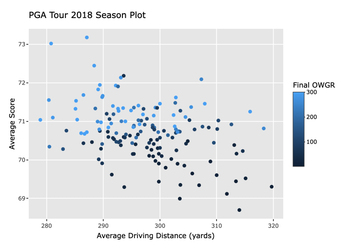
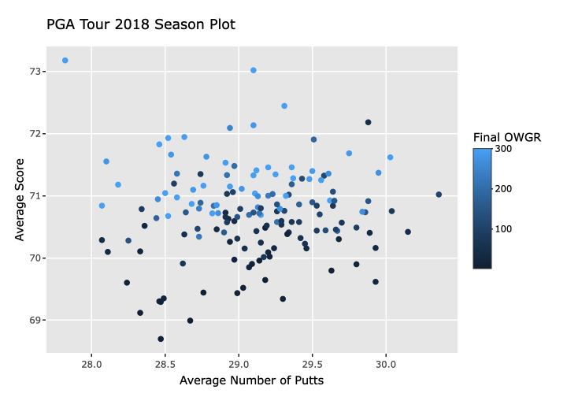
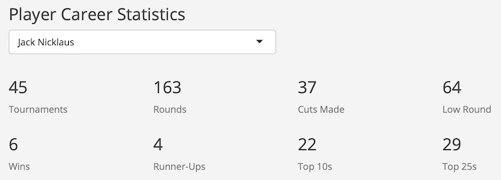

# STAT 310: Data Visualization Final Project

I created a Shiny app to visualize different features of PGA tour statistics. My goal for this final project was to combine many of the different features we had used throughout the semester to a domain I am passionate about -- golf. The app consists of two different sections which are described below. 

## Season Statistics
 The data are aggregated from two different sources. I was inspired by another golf analytics project from Patrick Cummings and used [his R script](https://github.com/pwc2/pga-tour-shiny/blob/master/loadData.R) to combine these two datasets.
-   A [Kaggle dataset](https://www.kaggle.com/jmpark746/pga-tour-data-2010-2018) containing records of PGA tour player season statistics for 2010 - 2018
- A [data.world dataset](https://data.world/neilgallen/official-world-golf-ranking) of the Official World Golf Rankings ([OWGR](http://www.owgr.com/)) collected since 2007. 

This section of the project is designed to explore the relationship between common PGA tour statistics for various seasons. The plots are created using ggplot and made interactive thanks to ggplotly. Hovering over the points shows information on the selected variables as well as the name and OWGR of each player where darker points correspond to higher world rankings. See the section below on results for some examples of how this tool can be used. 

## The Masters
The data in this section initially come from www.masters.com/. Special thanks to [Chris Teeter](https://www.cteeter.ca/) for sending me his csv file with the historical data scraped back to the first tournament in 1934.

[The Masters](https://en.wikipedia.org/wiki/Masters_Tournament) is the first, and most prestigious, of four major tournaments in the PGA tour's annual calendar. With the exception of the 2020 tournament (held in November due to covid-19), each tournament is held in April at Augusta National Golf Club. The winner is awarded a [Green Jacket](https://en.wikipedia.org/wiki/Masters_Tournament#Green_jacket) in addition to prize money -- part of what makes the tournament a ["tradition unlike any other"](https://www.mandourlaw.com/blog/jim-nantz-phrase-a-tradition-unlike-any-other-becomes-a-trademark/#:~:text=recently%20filed%20two%20trademark%20applications,associated%20with%20the%20Masters%20Tournament.&text=CBS's%20Jim%20Nantz%20actually%20coined,broadcaster%20for%20the%20Masters%20Tournament.).

This section of the project is designed to work with DataTables in shiny, as I had not used them in a project this semester yet. On the left panel, you can check out the leaderboard for any masters tournament by selecting the year. Note that by default, the chart includes only the players that made the 36-hole cut line. On the right panel, you can check out your favorite player's career statistics by typing or selecting their name in the search bar. You will see some summary statistics that provide an overview of their career at the Masters as well as a sortable table with each of their tournament results.

## Some Cool Results

I've highlighted a few results that I found to be interesting after playing around with the app. These are meant to demonstrate the features of the app and inspire further exploration.

### Drive for show or putt for dough?

This old golf saying refers to the idea that one who can drive the ball really far and not putt as well relatively will not perform as well as those who have really good putting skills compared to their driving distance. At this point, it's common knowledge among modern golfers to know that this old saying has been proven false. We can see this difference visually between the two plots below. 

Notice how there is a clear negative association between average driving distance and average scores, whereas there is no clear relationship between average number of putts and average score. Also we can see how the color of the dots -- which correspond to the world ranking -- follow the same pattern. Both plots show that lower average scores are associated with higher world rankings (which makes sense intuitively). However, driving distance also appears to be correlated with OWGR as the dark blue points are mostly in the lower right and the light blue points are mostly in the top left. 

Clearly, these plots suggest that driving the ball further is actually an advantage. Play around with the "Season Statistics" tab to see how driving distance and putting correlated with tournament winnings or FedEx Cup points (hint: we see a similar result!). Maybe the saying should now be putt for show, drive for dough!

### Masters Career of Jack Nicklaus

Jack Nicklaus is undoubtably one of the best golfers of all time, and he's had great success on golf's greatest stage. Jack's 22 top 10s, 29 top 25s, and 6 green jackets are all masters records. In addition, his low round of 64 is one off the course record and he's tied for the most all time runner-ups (4) with Ben Hogan and Tom Weiskopf. 

Check out your favorite player by entering in their name in the Masters tab!
 

